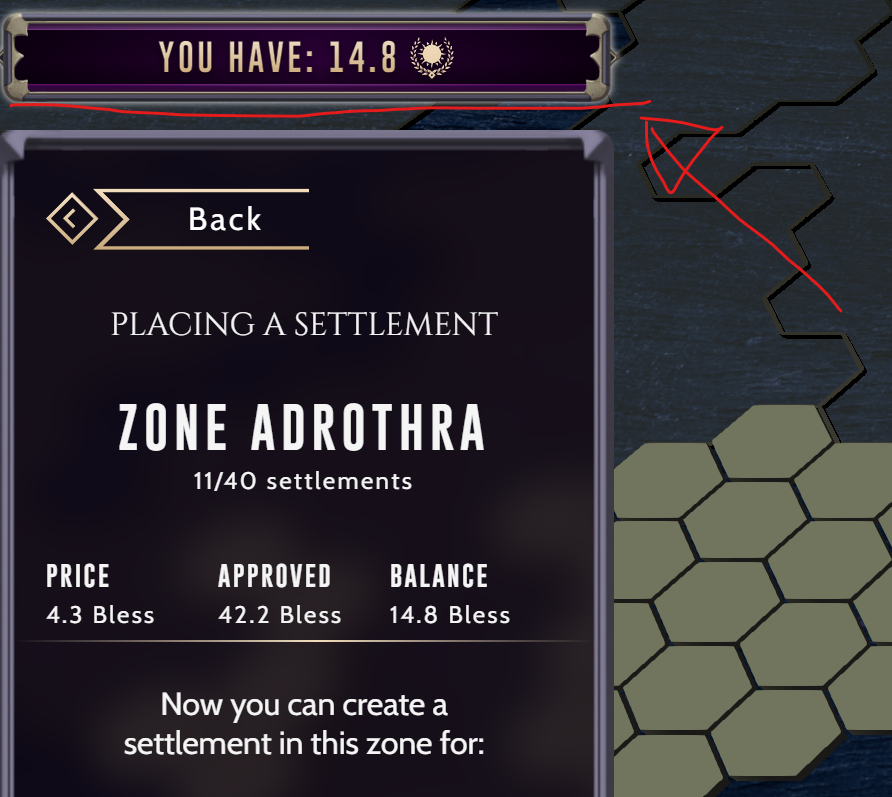

# mithraeum-public-assets

Repository includes interfaces generated with [typechain](https://www.npmjs.com/package/typechain)

# Addresses

All related addresses to the current version of the game (for stage) can be fetched from World. This data is also
accessible from game's local storage.

| Name           | Address                                    |
|----------------| ------------------------------------------ |
| World          | 0x66192bb914Bab03a12c0D2DD9A01B81Aa851ca6B |
| Registry       | 0xC7eEac0796A0bE4bbAd1febe5A69eF8D971C2064 |
| Bless token    | 0xe9d7618b60367aCED209a510755f8F6ae5C1ff45 |
| Food           | 0x13e15598DA9e20D080Ec47934Dc1Aa9a9b590652 |
| Wood           | 0x4644df4ca933491a52478194f71fF57950D70dbD |
| Copper         | 0x53a72Ec20935c7C8d4043F5714196F26a967eC2F |
| Tools          | 0x7aA9F533A8a09d93e53AC4D06C178460879A497f |
| Warrior        | 0xC2f15b58825E12c5AfFeF2469F6454A541Bf363B |
| Archer         | 0x638F6B636FE1FfA168eb10501510510023b29573 |
| Horseman       | 0xceaf900b3a6bCCa772192bD97081F68d258EBBbD |
| Workers        | 0x6b0DA0073F6f575BA9A03454eb1Ba150005aF378 |
| Prosperity     | 0x8cA82E7E321477b59E421dce44823e01787728C3 |
| MithraeumFlags | 0x4274A467971280e8b0E23bed2eBDDeB9597b680a |

# The Graph

We also have some indexation running on The Graph services and available [here](https://api.thegraph.com/subgraphs/name/romang11/mithraeum-stage)

# Docs

Generated docs can be found in [this gitbook](https://mithraeum.gitbook.io/mithraeum-dev/)

# Access tokens

To receive access tokens (BLESS) for settlement placement click here on "place-settlement" page

